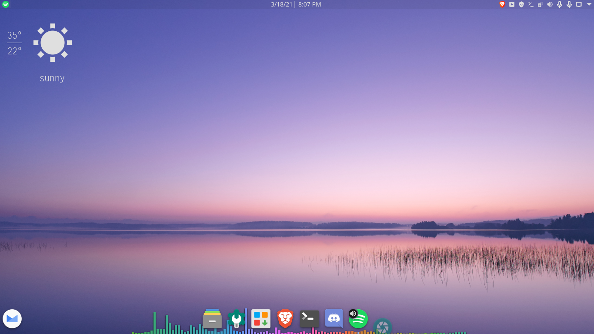
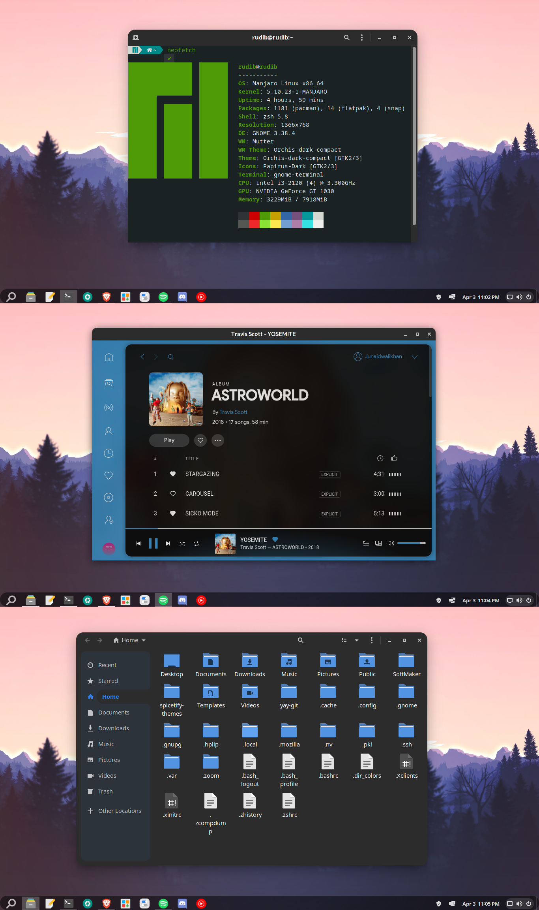

# linux-ricing-portfolio

Here are some of the examples of my rices on Linux over the years.
  

## First attempt using the KDE Desktop Environment

I tried to make something super simple with minimal look and feel
  

  

## Second attempt was done using the Gnome desktop environment running Manjaro.

This had a Windows feel with a touch of Chrome OS.
  

Design specifications: 
Application theme: Orchis-Dark Compact 
Icons: Papirus Dark 
Shell Theme: Orchis-Dark Compact 

## Favourite one using KDE and Manjaro

I love this rice the best because it has the most features and is a perfect mix of Windows and Mac OS. I used Manjaro for this one as well since I felt it was the best distro for my use case.

Design specifications: 
Application Style: Breeze 
Plasma Style: ChromeOS 
Colors: Materia Dark (Edited) 
Window Decorations: Orchis-Dark 
Icons: ePapirus 
Cursor: Adwaita 
Dock: Latte Dock (latest git version) 
Spotify Mod: Spicetify 
Spicetify Theme: DribblishDynamic 

